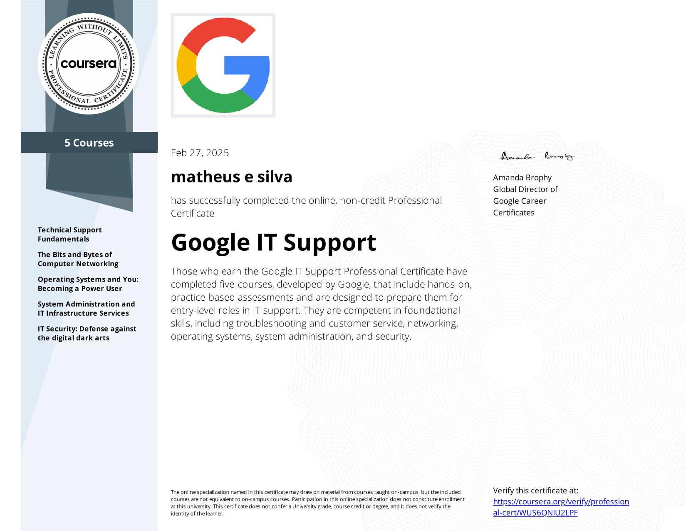

## [Google IT Support Professional Certificate](https://www.coursera.org/professional-certificates/google-it-support)

 

 

### About this Professional Certificate

This professional certificate developed by Google includes an innovative curriculum designed for entry-level IT support roles. I was trained and equipped for remote or on-site help desk work. Through a mix of video lectures, quizzes, and practical labs and widgets, the program taught me how to develop problem-solving, customer service, networking, operating systems, system administration, and security skills. This course is comprised of 5 courses focused on specialized IT support.

### Applied Learning Project

Through this Professional Certificate program you'll have access to a variety of hands-on assessments which will help you to simulate many of the experiences of IT support that are critical for success in the workplace.

Examples of virtual assessments include Assembling a Computer, Networking simulation, Writing Effective Support Documentation, Routing Paths and Subnets, Wireless Networking, Device Software Management, Public Key or Asymmetric Encryption, Incident Handling, among many other hands-on learning application.

### Skills I gained

- Binary Code
- Customer Support
- Linux
- Troubleshooting
- Domain Name System (DNS)
- Ipv4
- Network Model
- Powershell
- Linux File Systems
- Command-Line Interface
- Directory Service
- Lightweight Directory Access Protocol (LDAP)

## Courses in this Professional Certificate

### Course 1 - Technical Support Fundamentals.

In this course, I received a comprehensive introduction to the world of Information Technology, learning the fundamentals and preparing myself for a career in IT support. Let me tell you what I learned:

## Comprehensive Overview:

- I gained an overview of various areas of IT, including hardware, software, networking, troubleshooting, and customer service.
- I understood the impact of the Internet on the modern world.
- I received an overview of what is to come in this certification program.

## Practical Skills:

- I learned to assemble a computer from scratch.
- I learned to choose and install an operating system.
- I learned to utilize common troubleshooting methodologies and soft skills in an Information Technology environment.

## Technical Fundamentals:

- I mastered the binary system, which is the foundation of computing.
- I understood how applications are created and function.
- I understood what the Internet is and how it works.

## Troubleshooting:

- I developed skills to solve common IT problems.
- I learned to utilize common troubleshooting methodologies.

In summary, this course gave me a solid foundation in IT, preparing me to handle the daily challenges in the field of technical support.

### Course 2 -The Bits and Bytes of Computer Networking.

In this course, I delved deeply into the world of computer networking, learning everything from foundational concepts to cutting-edge technologies. Let me tell you what I learned:

## Comprehensive Overview:

- I gained a complete understanding of networks, from the basics to cloud computing.
- I learned how network protocols, such as TCP/IP, function as the bedrock of internet communication.
- I studied essential services like DNS and DHCP, which ensure seamless network operation.
- I became proficient in the five-layer network model.

## Practical Skills:

- I developed the ability to identify and resolve network issues, utilizing efficient tools and techniques.
- I acquired knowledge of cloud storage and everything-as-a-service (XaaS).

## Technical Fundamentals:

- I mastered standard TCP/IP communication protocols, which are essential for any networking professional.
- I gained in depth knowledge of cloud computing.

## Troubleshooting:

- I honed my skills in diagnosing and resolving network problems, from simple to complex.
- I learned to utilize network troubleshooting tools and techniques.

In essence, this course provided me with a solid foundation in computer networking, preparing me to tackle real-world challenges in the IT field.

### Course 3- Operating Systems and You: Becoming a Power User.

In this course, I learned all about operating systems, from the fundamentals to complex tasks. Let me tell you what I learned:

## Comprehensive Overview:

- I gained a complete understanding of the core components of an operating system, for both Windows and Linux.
- I understood how system processes function and how to manage them.
- I learned about system logs and remote connection tools.

## Practical Skills:

- I learned to navigate Windows and Linux file systems, using both graphical user interfaces and the command-line interface.
- I learned to configure users, groups, and permissions for account access.
- I learned to install, configure, and remove software on Windows and Linux operating systems.
- I learned to configure disk partitions and file systems.

## Technical Fundamentals:

- I understood how system processes function and how to manage them.
- I learned to work with system logs and remote connection tools.

## Troubleshooting:

- I developed skills to troubleshoot common operating system problems, using my technical knowledge.
- I learned to utilize operating system knowledge to troubleshoot common problems in an IT Support Specialist role.

In summary, this course gave me a solid foundation in operating systems, preparing me to handle day-to-day challenges in the IT support field.

### Course 4 - System Administration and IT Infrastructure Services.

In this course, I learned how to transition from managing a single computer to administering a complete IT infrastructure. Let me tell you what I learned:

## Comprehensive Overview:

- I gained a complete overview of system administration, from essential infrastructure services to cloud management.
- I understood how the most common infrastructure services that keep an organization running work, and how to manage infrastructure servers.
- I learned how to maximize the cloud for an organization.

## Practical Skills:

- I learned to utilize best practices for choosing hardware, vendors, and services for an organization.
- I learned to manage an organization's computers and users using directory services, Active Directory, and OpenLDAP.
- I learned to choose and manage the tools that an organization will use.
- I learned to back up an organization's data and know how to recover its IT infrastructure in case of disaster.

## Technical Fundamentals:

- I understood how the most common infrastructure services work.
- I understood how to maximize the cloud for an organization.

## Troubleshooting:

- I learned to utilize system administration knowledge to plan and improve processes for IT environments.
- I learned to recover an organization's IT infrastructure in case of disaster.
- In summary, this course gave me a solid foundation in system administration, preparing me to manage complex IT infrastructures and ensure the reliability of systems in a multi-user environment.

### Course 5 - IT Security: Defense against the digital dark arts.

In this course, I immersed myself in the world of IT security, learning everything from basic concepts to best practices for protecting systems and data. Let me tell you what I learned:

## Comprehensive Overview:

- I gained a complete overview of cyber threats and attacks, and the various ways they can occur.
- I understood how encryption algorithms work and how they are used to protect sensitive data.
- I learned about the three pillars of information security: authentication, authorization, and accounting.
- I learned about network security solutions, including firewalls and Wi-Fi encryption.
- I learned about multi-layered security architecture.

## Practical Skills:

- I learned to assess potential risks and recommend ways to reduce them.
- I learned best practices for protecting networks against cyber attacks.
- I learned how to help others understand security concepts.

## Technical Fundamentals:

- I understood how various encryption algorithms and techniques work, as well as their benefits and limitations.
- I learned about various authentication systems and types.
- I understood the difference between authentication and authorization.

## Troubleshooting:

- I learned to integrate a security culture into an organization or team.

In summary, this course gave me a solid foundation in IT security, preparing me to protect systems and data against cyber threats and implement security best practices in any environment.
